# 에너지 근거 검토 · P12

The unchanged native architecture diagram remains first. The current versioned UI places admitted source/audit/rows beside the confirmed query, exact CPU result and native chart. Original bytes, seven-field policy, semantic review, separate source confirmation and authority revocation remain unchanged. This UI/media update adds **0 model calls**; the frozen development and exposed-conformance batches remain **3 + 9 = 12 calls**, with 0 retries and 0 demo inference.

Run the current presentation with `node ui-v2/server.mjs`, then open `http://127.0.0.1:5162`. `npm start` serves the preserved historical presentation on port 5120. Node 20+; no application dependencies or new downloads. [Feature inventory](docs/ui-refit/feature-inventory.md) · [16 actual local Chrome checks](evidence/ui-refit/browser-checks.json) · [exact current and historical media identities](evidence/ui-refit/media-manifest.json). The **47 Node tests** include one overlay-route integration regression; GitHub CI runs CPU checks. Chrome checks and captures ran separately in the existing local capture environment, not in GitHub CI.

현재 원본 입장·품질 감사.

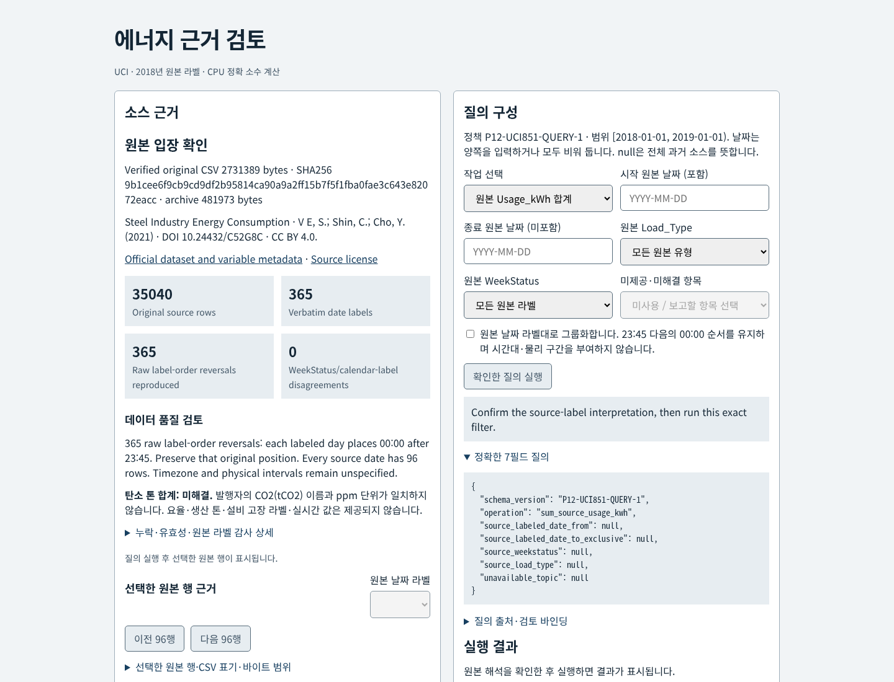

날짜와 정확한 7필드 질의.

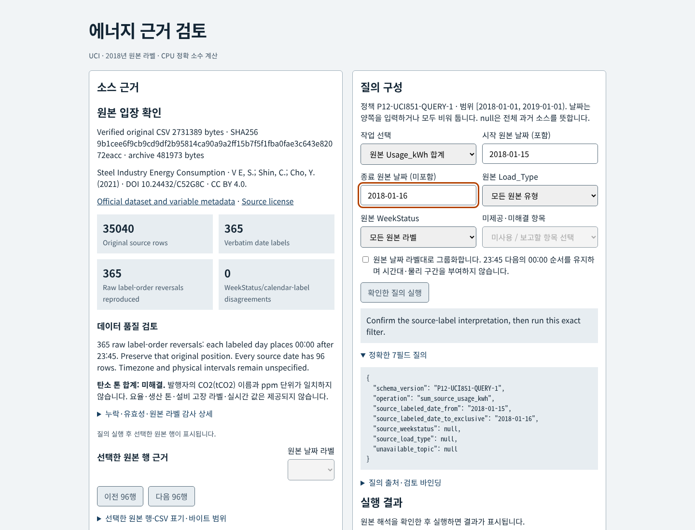

1월 15일 CPU 합계·원본 행·차트.

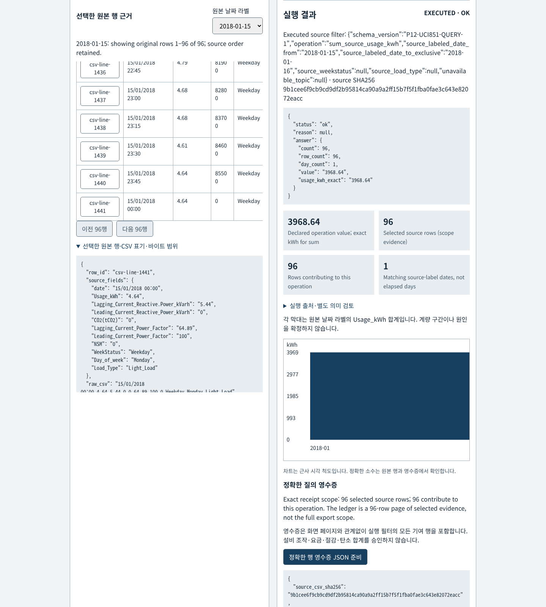

정확한 영수증과 세션 기록.

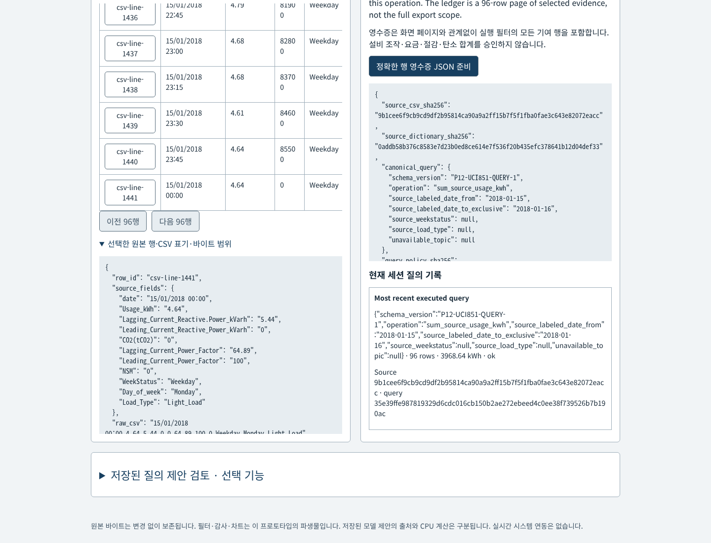

부분 범위: Not evaluated.

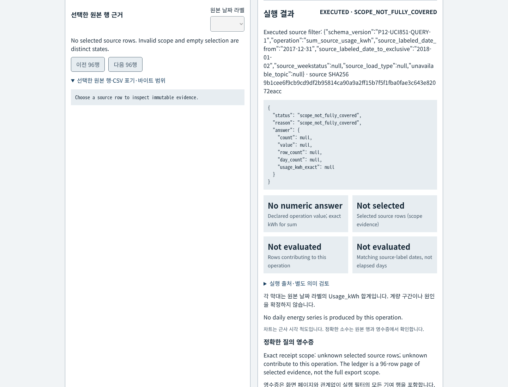

탄소 단위: 미해결.

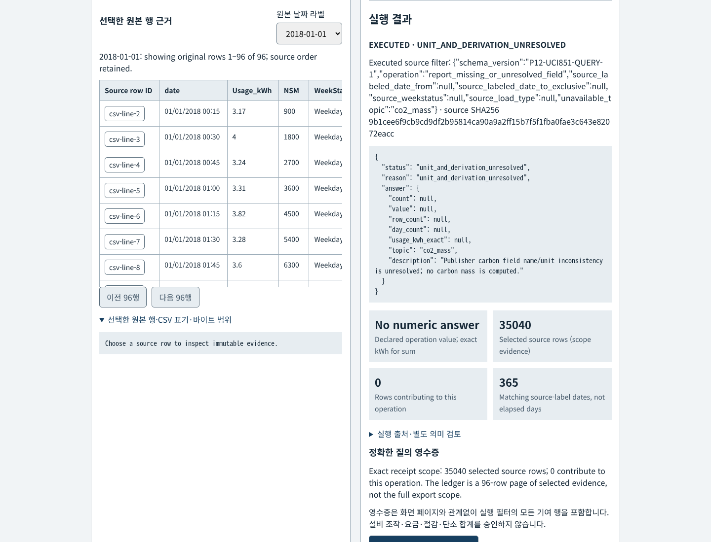

저장된 실제 D1 제안의 의미 검토.

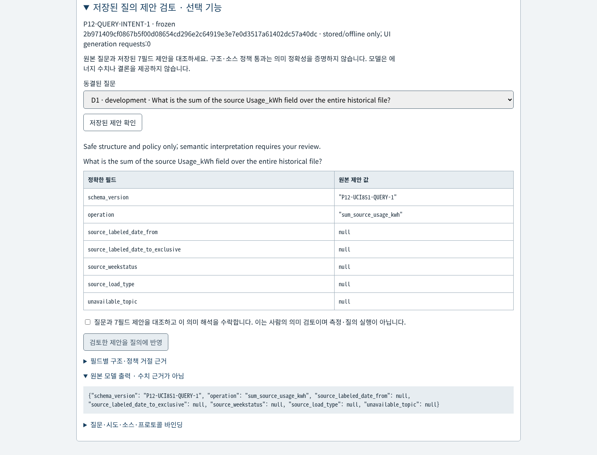

실제 E3의 잘못된 Weekday 제한: 수락 보류.

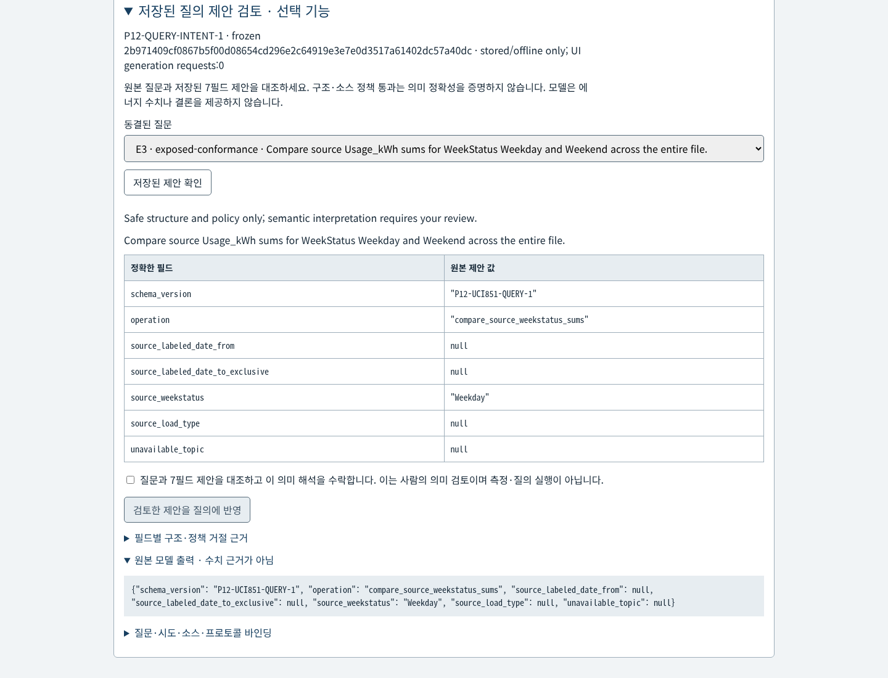

원본 읽기 실패: 과거 근거만 보존.

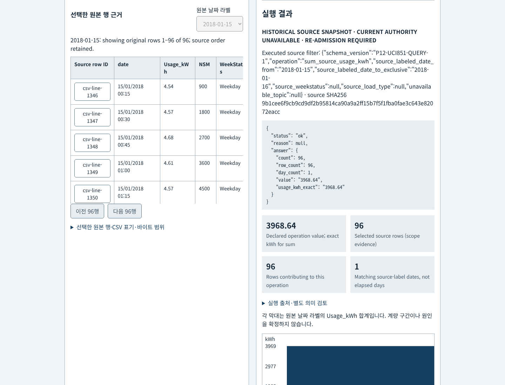

390px 실제 브라우저 화면.

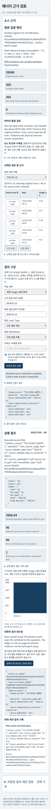

These are new native browser screenshots. D1 and E3 use unchanged stored actual outputs; E3's erroneous extra Weekday filter receives no human acceptance in the capture. E4's preserved invalid date is also checked for policy rejection. No generated replacement or synthetic output is presented as a model result. The result `3968.64` and all row counts are credited only to deterministic CPU computation. The native chart uses approximate geometry and unconverted source labels. Source/dictionary/policy faults affect only owned test copies; originals remain identical.

All media under `docs/` and `docs/intent-v1/` outside `docs/ui-refit/` below are **historical** captures/diagrams. The two existing CPU/native stored-intent videos are historical, unchanged, and do not show this refit. No new video was recorded. Their receipt/acknowledgment captions do not establish target import or operational authority. No Library upload was attempted during this update; the previously documented desktop transfer blocker remains.

## Preserved source, architecture and experiment evidence

### Steel energy source evidence desk · P12

A native evidence desk for the public UCI Steel Industry Energy Consumption dataset. Admit pinned original bytes, inspect data-quality limits, confirm a visible allowlisted query, and follow its exact decimal answer back to every contributing CSV row. The first diagram shows the original main CPU path; the optional stored-intent review branch is documented separately below. All glyphs are original generic artwork. [Current editable SVG](docs/intent-v1/architecture-current.svg) · [current glyph provenance](docs/intent-v1/asset-provenance.json). The original [baseline SVG](docs/architecture.svg) and [PNG](docs/architecture.png) remain unchanged; the new derivative enlarges only labels for narrow published rendering.

This is an executed **historical-data prototype with CPU arithmetic** and a separately frozen optional stored-query-intent branch. The optional development batch used **3 generation calls** under an explicit resource handover. It has no live connection, SQL generation, equipment control or carbon/billing authority. The source labels refer to 2018; they are not current readings. No throughput, ROI, savings or fault-diagnosis claim is made.

## Historical native demo

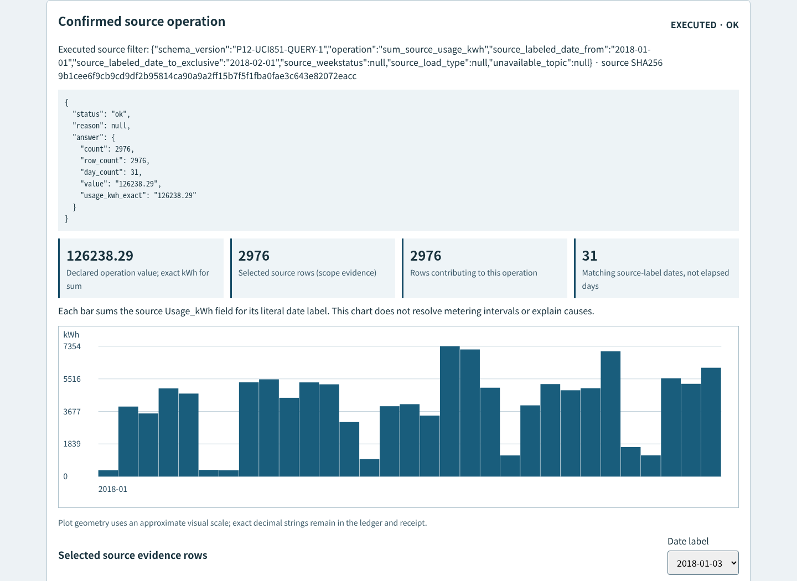

[CPU demo video](docs/cpu-demo.mp4) · [390px capture](docs/energy-mobile-390.png) · [admission/audit](docs/admission-desktop.png) · [unresolved carbon evidence](docs/unresolved-desktop.png) · [partial coverage](docs/partial-coverage-desktop.png) · [previous-query state](docs/stale-query-desktop.png).

These original baseline screens and video remain unchanged from CPU commit 703b721. They come from actual browser actions against the admitted source and contain no simulated model response. Current authority/intent captures are linked below; the historical partial-coverage frame predates the corrected nullable date-count display. The Gantt-free daily chart scrolls on narrow screens; its approximate geometry never supplies the authoritative numerical answer. Exact decimal strings and original CSV lexemes remain accessible in the ledger and JSON receipt.

## Run locally

Node 20+ is sufficient; application/runtime tests have no package dependencies.

```sh
npm test
npm start
# Open http://127.0.0.1:5120
node scripts/build-evidence.mjs
python3 scripts/independent-arithmetic.py
```

Original ZIP and CSV are included unchanged, so startup and CI require no source download. `acquire-source.py` documents the bounded official-HTTPS admission: verify pinned archive and member checksums before exclusive file creation; it does not overwrite an existing source. Browser/media reproduction additionally needs installed Python Playwright, Chrome at `/usr/bin/google-chrome`, and FFmpeg. Those were available in the capture environment; they are not application dependencies. Run `python3 scripts/browser-check.py` to reproduce the actual UI checks and captures, using only an owned temporary source copy for mutation.

## Source and licenses

V E, S., Shin, C., & Cho, Y. (2021). *Steel Industry Energy Consumption*. UCI Machine Learning Repository. [DOI 10.24432/C52G8C](https://doi.org/10.24432/C52G8C). [Official dataset and variable metadata](https://archive.ics.uci.edu/dataset/851/steel+industry+energy+consumption) · [official archive](https://archive.ics.uci.edu/static/public/851/steel+industry+energy+consumption.zip). Source license: [CC BY 4.0 legal code](https://creativecommons.org/licenses/by/4.0/legalcode). Original data bytes are retained. This project's derived audits, filters, charts and source dictionary are identified separately; no publisher endorsement is implied. See [DATA-LICENSE.md](DATA-LICENSE.md). Original application code and generic artwork use [MIT](LICENSE).

| Original file | Bytes | SHA256 |
|---|---:|---|
| ZIP | 481973 | `d82d28b33780ff1582507fcf08ae764ff648af459d58234370c551e62aadeaef` |
| Steel_industry_data.csv | 2731389 | `9b1cee6f9cb9cd9df2b95814ca90a9a2ff15b7f5f1fba0fae3c643e82072eacc` |

[Admission record](data/admission.json) · [dictionary projection and interpretation limits](data/source-dictionary.json).

Only the leading UTF-8 BOM is removed for decoding. All 11 original header spellings are retained, including `Lagging_Current_Reactive.Power_kVarh` and `Leading_Current_Reactive_Power_kVarh`. `WeekStatus` cells contain text even though publisher metadata describes 0/1. The publisher's `CO2(tCO2)` name and ppm unit do not establish carbon mass; this prototype refuses a carbon-tonne aggregation.

## Reproduced evidence and its meaning

[Executed CPU conformance](evidence/cpu-conformance.json) and a separate [standard-library Decimal/integer-hundredths computation](evidence/independent-arithmetic.json) agree. These are independent arithmetic computations on the same admitted bytes, not source-author labels or model grades.

| Source-label scope | Rows | Distinct source-label dates | Exact sum of Usage_kWh |
|---|---:|---:|---:|
| Whole source | 35040 | 365 | 959636.71 |
| January 2018 | 2976 | 31 | 126238.29 |
| 15 January 2018 | 96 | 1 | 3968.64 |
| 1 January 2018 | 96 | 1 | 351.86 |
| Weekday | 25056 | 261 | 842501.16 |
| Weekend | 9984 | 104 | 117135.55 |

Load_Type counts: Light_Load 18072, Medium_Load 9696, Maximum_Load 7272. Every literal source date has 96 rows. The audit independently reproduces **365 raw label-order reversals**, with `00:00` positioned after `23:45` within each date. Sorting timezone-neutral calendar coordinates yields 35039 consecutive 900-second gaps; neither observation establishes a timezone or physical interval boundary. Browser tooltips display the source date label without timezone conversion, and the ledger retains original order.

The **stored source zero** is data row 29856, file line 29857 (`csv-line-29857`), raw label `07/11/2018 00:00`, Usage_kWh `0`. It remains a valid numeric source cell. This does not verify physical zero consumption. No original fields are missing or numerically invalid in the reproduced audit; synthetic missing/invalid cases remain separate regression inputs.

## Exact query boundary

[query-policy.json](query-policy.json) is the implementation contract `P12-UCI851-QUERY-1`; its raw-byte SHA256 is `dc1d2c97a5cc0a37448d6ece30da0cf51e8ce9a0e01437c3be8ba391002d32a3`.

Every query has exactly seven required keys, with unused values `null`. Extra fields, aliases and case-changed enums are rejected:

```json
{
  "schema_version": "P12-UCI851-QUERY-1",
  "operation": "sum_source_usage_kwh",
  "source_labeled_date_from": "2018-01-15",
  "source_labeled_date_to_exclusive": "2018-01-16",
  "source_weekstatus": null,
  "source_load_type": null,
  "unavailable_topic": null
}
```

| Operation | Result boundary |
|---|---|
| count_source_rows | Selected source-row count; no energy aggregation |
| sum_source_usage_kwh | Row count and exact two-decimal source-field sum |
| count_by_source_load_type | All three declared categories; no energy aggregation |
| compare_source_weekstatus_sums | Both declared categories and exact source sums |
| describe_source_time_order | Full raw order only; null dates and category filters |
| report_missing_or_unresolved_field | A declared availability/unknown state; no invented number |

Dates use strict Gregorian `YYYY-MM-DD`, both bounds or neither, start before exclusive end. Null bounds mean `[2018-01-01, 2019-01-01)`. Source dates are explicitly parsed from `DD/MM/YYYY HH:mm`; category filters are exact enums joined with AND. There is no ranking, extrema, arbitrary SQL, tariff, production quantity or causal inference in this version.

Validation precedence is shape/enum → calendar → range → coverage → selection → operation. `invalid_calendar_date`, `invalid_date_range`, wholly outside `period_not_in_historical_source`, partial `scope_not_fully_covered` and covered `empty_selection` remain distinct. Unknown enum is invalid, never an empty match. An empty group has rows 0, `empty_group`, sum null. A nonempty stored-zero sum can be `0.00`; missing or invalid measurements cannot be credited as zero.

| Unavailable topic | State |
|---|---|
| period_coverage | period_present_in_historical_source for a valid covered request; no energy aggregation |
| co2_mass | unit_and_derivation_unresolved |
| energy_per_tonne | production_quantity_absent |
| electricity_cost | tariff_and_billing_rules_absent |
| equipment_fault_cause | equipment_and_fault_cause_labels_absent |
| source_timezone | source_timezone_unresolved |
| physical_interval_boundary | physical_interval_semantics_unresolved |

Applicable filters survive an unknown-topic query. Its answer count/value remain null, while the separately labeled receipt may record the selected evidence scope and zero contributing rows. Invalid pre-selection requests have no fabricated scope count. Different groups retain their own zero/empty/incomplete states without granting a complete aggregate.

## Review and exact-row receipt

The human confirms literal source-label interpretation before running a query. Changing inputs labels displayed evidence as the previous executed query and disables receipt preparation until fresh confirmation/execution. Delayed responses cannot reauthorize changed inputs or replace a newer date ledger; later explicit focus is retained. Clearing confirmation disables export. Local history records each executed filter and source binding without adding kWh to non-energy operations.

The server rechecks CSV, dictionary and policy hashes on each API access. Any admitted-byte change or read failure denies cached rows and receipts and requires re-admission. The client retains prior evidence under an explicit historical/unavailable banner, clears confirmation and disables fresh query/receipt actions. Delayed query or row responses cannot restore revoked authority. Receipt preparation recomputes the query and rejects mismatched source/fingerprint. The immutable `receipt` binds all three digests, canonical query, selected and contributing row IDs/counts, exclusions, exact decimal answer and unresolved states. The visible 96-row ledger page is explicitly smaller than full receipt scope.

The fingerprint is SHA256 of UTF-8 `JSON.stringify(receiptWithoutQueryFingerprint)` in the implementation's declared member insertion order; it is not a claim of general RFC8785 canonicalization. Export keeps that object unchanged inside an envelope with a separate acknowledgment. [Actual Jan15 receipt](evidence/jan15-receipt.json) contains all 96 contributing IDs. “Prepared and acknowledged” does not prove client download completion or target-system import, and authorizes no equipment or billing action.

## Verification and experiment status

The original 30 Node tests cover source integrity, exact decimals, BOM/header preservation, invalid calendars/enums, precedence, empty groups, missing versus stored zero, source pointers, pure non-energy selection, digest binding and stale exports. [16 actual CPU Chrome checks](evidence/browser-checks.json) cover Tab/Enter, stable and explicit focus, delayed/repeated/stale responses, clearing confirmation, exact receipt bytes, unknown/empty/invalid scopes, stored source zero, cross-timezone labels and 390px readability. Browser checks are engineering regressions, not accessibility certification. [Before-repair reproduction](evidence/ui-before-repair.json) preserves the receipt/confirmation/chart failures rather than hiding them. A native keyboard regression also caught and fixed focus loss while the submitting button was disabled. The video is sampled from actual native browser frames at 5 fps and encoded with the available system FFmpeg; no new media binary or model was installed.

All 12 disclosed CPU conformance cases executed. Their expected meanings were already exposed, so they are **not an independently unseen benchmark**. The optional protocol below was frozen before inference; its separately reported three-case development batch is now complete.

## Optional stored query intent · frozen before inference (historical media)

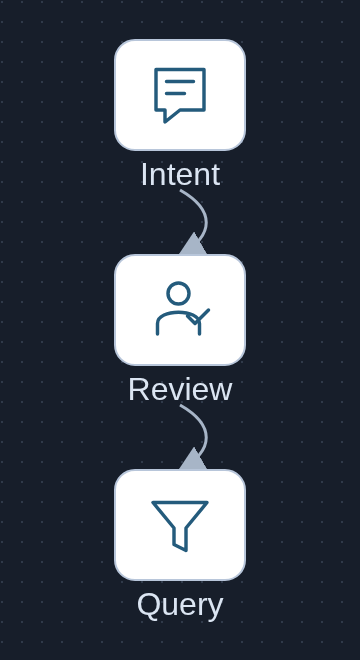

This separate branch reads stored raw attempts and can populate the manual builder after human semantic confirmation. It does **not** run inference or execute a query. The builder requires a separate confirmation of source-label interpretation before deterministic execution. [Editable branch SVG](docs/intent-v1/optional-branch.svg) · [original glyph provenance](docs/intent-v1/asset-provenance.json).

The model may propose only the exact seven-field query above. The UI displays the original question, every raw field, unmodified output, field-specific structural/policy errors, and question/source/protocol fingerprints. Valid structure is explicitly **not proven semantic correctness**. Confirmation binds the exact raw attempt and query; replacement, changed fields or unavailable source cannot inherit acceptance. A separate human review receipt never becomes arithmetic authority or an immutable CPU query receipt.

Method paths: [prompt](experiments/query-intent-v1/prompt.txt), [typed schema](experiments/query-intent-v1/schema.json), [runtime](experiments/query-intent-v1/runtime.json), [protocol and metrics](experiments/query-intent-v1/protocol.md), [freeze](experiments/query-intent-v1/freeze.json). Installed Ollama 0.17.7 / existing qwen3:4b Q4_K_M, context 4096, output 640, timeout 60 seconds, concurrency 1, temperature 0, seed 42; no retries or demo calls. The complete raw-prompt UTF-8 byte bound reserves 640 output plus 128 safety tokens and leaves at least **1007 conservative context tokens**. This is not measured tokenization; actual API token counts will be retained if granted.

Planned initial batch: **3 declared development questions D1–D3, once each**. Gate: all three provenance-valid completed outputs, strict schema, 21/21 exact raw fields and three policy-allowed proposals. Only after a separate report/handover may the **9 exposed conformance questions E1–E9** run unchanged. These disclosed inputs are not unseen evaluation. Invalid/outside dates must survive raw output for backend rejection; a correct interpretation may still be policy-rejected. Every scheduled failure remains in the denominator; deterministic repair receives zero model credit. Phase reports refuse overwrite.

Actual model generation calls: **12** across the separate completed three-case development and nine-case exposed-conformance batches, with **0 retries and 0 demo inference**. UI inspection and native captures trigger none. CPU tests use explicitly labeled in-memory synthetic transport fixtures, never stored under model-results paths and never credited as inference. Original CPU source, policy, arithmetic, evidence and media remain protected by 24 frozen baseline digests.

Prior engineering checks: **46 Node tests**, **4 pure protocol/budget tests**, **8 mocked transport-failure tests**, plus [28 actual CPU Chrome authority/offline and synthetic-review checks](evidence/intent-v1/browser-checks.json). Missing/unreadable source, dictionary and policy copies revoke client authority. Preselection calendar/range/outside/partial failures show **Not evaluated**, while covered empty selection shows **0**. [Historical corrected partial coverage](docs/intent-v1/scope_not_fully_covered-desktop.png) · [historical source failure](docs/intent-v1/missing-source-historical-desktop.png) · [offline intent at 390px](docs/intent-v1/not-run-intent-mobile-390.png). The separate [six in-memory mock-transport UI checks](evidence/intent-v1/cpu-mock-transport/browser-checks.json) cover semantic-review clarity, two confirmations, exact export binding, delayed/stale/repeated review, field-specific rejection and keyboard/mobile behavior. Those fixtures are explicitly synthetic CPU test inputs, not model outputs. The preserved [mobile overflow reproduction](evidence/intent-v1/before-mobile-repair/before-mobile-repair.json) precedes the wrapping fix. Browser checks are bounded engineering evidence, not accessibility certification.

```sh
python3 scripts/test-intent-protocol.py
python3 scripts/test-intent-transport.py
python3 scripts/browser-intent-check.py
python3 scripts/browser-intent-startup-check.py
# Generation runner requires a separate explicit GPU resource handover.
```

## Executed three-case development result

A separate [delayed-startup before/after regression](evidence/intent-v1/startup-repair.json) reproduced an unavailable source response arriving from the initial intent-list request after a successful manual query. Startup now uses shared authority revocation: confirmation and fresh actions clear while the exact cached answer stays historical. Only an owned source copy was renamed; original bytes and the frozen inference method/results were unchanged. [Before repair](docs/intent-v1/startup-repair/before-repair.png) · [after repair](docs/intent-v1/startup-repair/after-repair.png).

Frozen method commit: [`4b027eb92fe4208d43bc64cbe9f573d0b66dad03`](https://github.com/Kimhyuntae9665/steel-energy-source-evidence-desk/commit/4b027eb92fe4208d43bc64cbe9f573d0b66dad03), freeze SHA256 `2b971409cf0867b5f00d08654cd296e2c64919e3e7e0d3517a61402dc57a40dc`. [Write-once raw-field report](model-runs/query-intent-v1/development-report.json) · [unmodified D1 attempt](model-runs/query-intent-v1/development/D1.json) · [D2](model-runs/query-intent-v1/development/D2.json) · [D3](model-runs/query-intent-v1/development/D3.json).

Three scheduled/attempted/completed HTTP200 requests: **3/3 strict raw intents, 21/21 raw fields, 3/3 structurally valid, 3/3 policy-allowed, 0 unexpected fields**. There were no failures, retries or additional inference calls. This checks only the three declared full-source development questions under this prompt/schema; it does not establish general natural-language accuracy. This development report predates the separately authorized nine-case exposed-conformance batch below; those cases contribute nothing to the development score.

The literal **21/21** consists of **three operation choices, three schema-version values, and fifteen null filter/topic values**. These three full-source questions provide no model-tested evidence of date extraction, category-filter selection, invalid/outside-date preservation, or unknown-topic routing. The result establishes the disclosed development mappings only; backend arithmetic and synthetic regressions supply separate evidence.

| Case | Raw operation | API input/output tokens | Local request elapsed |
|---|---|---:|---:|
| D1 | sum_source_usage_kwh | 513 / 71 | 3149.28ms |
| D2 | count_by_source_load_type | 511 / 71 | 1406.21ms |
| D3 | describe_source_time_order | 509 / 70 | 1363.03ms |

These are retained API counts and local request timings, not production latency measurements. The model supplied no energy number. A [native stored-output capture](evidence/intent-v1/actual-stored-development.json) then reviewed D1's exact seven fields, required a separate source-label confirmation and executed the unchanged deterministic CPU query. Its source sum `959636.71` is credited only to CPU arithmetic, not the model.

[Actual raw proposal/human review](docs/intent-v1/actual-stored-development/raw-proposal-human-review.png) · [separate CPU result](docs/intent-v1/actual-stored-development/human-reviewed-cpu-result.png) · [native stored-intent video](docs/intent-v1/actual-stored-development/stored-intent-cpu-demo.mp4). Captures use stored actual output and add **0 inference calls**; synthetic regression screenshots remain separately labeled. [Media identity manifest](evidence/intent-v1/media-manifest.json) records file hashes. No confirmed Library media IDs are available: the supported desktop upload helper cannot start because that desktop has no Python runtime. The verified public repository copies remain available.

The lease was explicitly released after all three durable completion records, a free shared lock, absent timeout barrier, zero loaded models and zero GPU compute processes were verified.

## CPU readiness for the separate exposed-conformance batch

[Write-once readiness manifest](experiments/query-intent-v1/exposed-conformance-readiness.json) binds the unchanged E1–E9 question text, canonical request digests, per-request input bounds/headroom, exact seven-field labels and expected policy states to the existing freeze. Preparation makes **0 generation calls** and grants no inference resources. The nine already-exposed questions were subsequently run once after a separate explicit handover, under this committed request/scoring freeze; they are not an unseen benchmark.

The same grading retains **63 raw fields across 9 scheduled cases**, with strict full-query matches, structural validity and policy permission reported separately. Failed or absent outputs remain in their scheduled denominators; deterministic repair receives zero model credit. Runtime remains context 4096/output 640, timeout 60 seconds, concurrency 1, retries 0 and demos 0. Prompt, schema, questions, disclosed labels, scoring, all 19 frozen method files, 24 protected baseline files, and existing development results remain unchanged.

This prepared set does not test every route: `source_weekstatus` is null in all nine labels; E3 requests a comparison operation rather than a WeekStatus filter. `count_source_rows` appears in neither the three executed development cases nor the nine prepared cases, so it remains untested by model output. The separately reported conformance results below cover the disclosed date, Load_Type-filter and unavailable-topic questions; they do not establish broad generalization.

```sh
# Pure CPU construction once; refuses to overwrite an existing manifest.
python3 scripts/prepare-exposed-conformance.py
# Pure CPU identity/budget verification after preparation; no model call.
python3 scripts/prepare-exposed-conformance.py --check
```

## Executed nine-case exposed conformance result

The separate request/scoring freeze was committed at [`b760d33e1005aca15ac704a7b94116f9ccb91bd5`](https://github.com/Kimhyuntae9665/steel-energy-source-evidence-desk/commit/b760d33e1005aca15ac704a7b94116f9ccb91bd5), readiness SHA256 `cbb405f1d37972e0567c95a5aa319791e46021688598626b8d10143dd6433998`. Prompt, schema, runtime, source, labels and original development outputs were unchanged. These nine familiar questions are **exposed conformance checks, not held-out accuracy**.

Exactly **9 scheduled, attempted and completed requests**, all HTTP200 with completion records: **9/9 valid structures, 59/63 exact raw fields, 6/9 exact complete intents, 7 policy-allowed and 2 policy-rejected**; no unexpected fields, retries, tuning, repair or demo calls. [Write-once raw-field report](model-runs/query-intent-v1/exposed-conformance-report.json) and [all unmodified attempt receipts](model-runs/query-intent-v1/exposed-conformance) preserve every scheduled denominator. The inherited `development_gate_passed:false` field is development-only and deliberately false for this phase; it does not revoke the earlier three-case development gate.

| Cases | Raw intent result | Separate deterministic result |
|---|---|---|
| E1 / E2 | Exact January / January15 date-scope queries | CPU returns `126238.29` for2976 rows and `3968.64` for96 rows. These numbers are not model arithmetic. |
| E3 | Incorrect extra `source_weekstatus=Weekday` filter narrows the requested comparison | CPU executes that uncorrected query: Weekday sum `842501.16`; Weekend remains `empty_group` with zero selected rows and null sum. A policy-valid query can still be semantically wrong. |
| E4 / E5 | Wrong `describe_source_time_order` operation; E4 also omits the required `period_coverage` topic | Preserved date labels cause backend `invalid_calendar_date` / `period_not_in_historical_source`. Matching rejection states do **not** earn correct raw-intent credit. |
| E6–E9 | Exact unavailable-topic queries, including E9's `Maximum_Load` filter | Valid queries return unresolved CO2 mass, absent production quantity, absent tariffs/billing rules and absent equipment/fault-cause labels. Unknown answers are expected outcomes, not failed refusals; no numeric answer is invented. |

[CPU cross-report](evidence/intent-v1/exposed-conformance.json) records each unchanged raw query, selected/contributing counts and row-ID digests, query receipt fingerprint, raw semantic result and separate backend status. It is an engineering execution receipt, not a human product acceptance. All arithmetic stays in the pinned deterministic backend, with **zero arithmetic credit to the model**.

The GPU lease was explicitly released after all nine durable terminal records and runner exit, a free shared lock, absent timeout marker, zero loaded models and zero GPU compute processes were verified. Publication and grading were CPU-only. This bounded prompt/schema run cannot establish general extraction, financial/carbon inference or production latency. WeekStatus filtering and `count_source_rows` still lack a correct targeted model case in this protocol.

```sh
# Reproduce grading and CPU evidence without model calls or overwriting receipts.
node scripts/verify-exposed-conformance.mjs
node scripts/build-exposed-conformance-evidence.mjs --check
python3 scripts/prepare-exposed-conformance.py --check
```

## Deployment limits

Loopback single-process prototype, no accounts, durable multi-user history, production upload workflow, equipment integration, physical interval reconstruction or live data refresh. Original source pointers and receipts are evidence of a bounded calculation, not certification of metering or operational safety. Source labels and units require domain clarification before physical, billing or carbon use. Security/hosting and richer ingestion remain future engineering work, not delivered claims.
