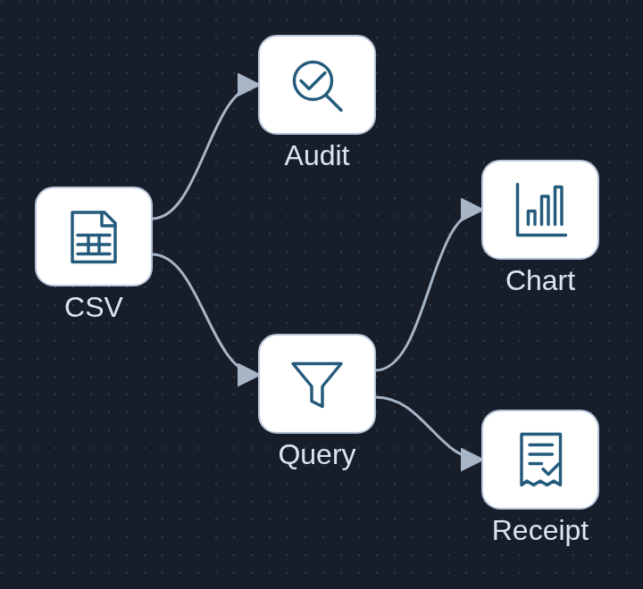

# Steel energy source evidence desk · P12

A native evidence desk for the public UCI Steel Industry Energy Consumption dataset. Admit pinned original bytes, inspect data-quality limits, confirm a visible allowlisted query, and follow its exact decimal answer back to every contributing CSV row. The diagram shows implemented components; its glyphs are original generic artwork. [Editable SVG](docs/architecture.svg) · [asset provenance](docs/asset-provenance.json).

This is an executed **CPU-only historical-data prototype**. It has no live connection, model calls, SQL generation, equipment control or carbon/billing authority. The source labels refer to 2018; they are not current readings. No throughput, ROI, savings or fault-diagnosis claim is made.

## Actual native demo


[CPU demo video](docs/cpu-demo.mp4) · [390px capture](docs/energy-mobile-390.png) · [admission/audit](docs/admission-desktop.png) · [unresolved carbon evidence](docs/unresolved-desktop.png) · [partial coverage](docs/partial-coverage-desktop.png) · [previous-query state](docs/stale-query-desktop.png).

Screens and video come from actual browser actions against the admitted source. No model response is simulated. The Gantt-free daily chart scrolls on narrow screens; its approximate geometry never supplies the authoritative numerical answer. Exact decimal strings and original CSV lexemes remain accessible in the ledger and JSON receipt.

## Run locally

Node 20+ is sufficient; application/runtime tests have no package dependencies.

```sh
npm test
npm start
# Open http://127.0.0.1:5120
node scripts/build-evidence.mjs
python3 scripts/independent-arithmetic.py
```

Original ZIP and CSV are included unchanged, so startup and CI require no source download. `acquire-source.py` documents the bounded official-HTTPS admission: verify pinned archive and member checksums before exclusive file creation; it does not overwrite an existing source. Browser/media reproduction additionally needs installed Python Playwright, Chrome at `/usr/bin/google-chrome`, and FFmpeg. Those were available in the capture environment; they are not application dependencies. Run `python3 scripts/browser-check.py` to reproduce the actual UI checks and captures, using only an owned temporary source copy for mutation.

## Source and licenses

V E, S., Shin, C., & Cho, Y. (2021). *Steel Industry Energy Consumption*. UCI Machine Learning Repository. [DOI 10.24432/C52G8C](https://doi.org/10.24432/C52G8C). [Official dataset and variable metadata](https://archive.ics.uci.edu/dataset/851/steel+industry+energy+consumption) · [official archive](https://archive.ics.uci.edu/static/public/851/steel+industry+energy+consumption.zip). Source license: [CC BY 4.0 legal code](https://creativecommons.org/licenses/by/4.0/legalcode). Original data bytes are retained. This project's derived audits, filters, charts and source dictionary are identified separately; no publisher endorsement is implied. See [DATA-LICENSE.md](DATA-LICENSE.md). Original application code and generic artwork use [MIT](LICENSE).

| Original file | Bytes | SHA256 |
|---|---:|---|
| ZIP | 481973 | `d82d28b33780ff1582507fcf08ae764ff648af459d58234370c551e62aadeaef` |
| Steel_industry_data.csv | 2731389 | `9b1cee6f9cb9cd9df2b95814ca90a9a2ff15b7f5f1fba0fae3c643e82072eacc` |

[Admission record](data/admission.json) · [dictionary projection and interpretation limits](data/source-dictionary.json).

Only the leading UTF-8 BOM is removed for decoding. All 11 original header spellings are retained, including `Lagging_Current_Reactive.Power_kVarh` and `Leading_Current_Reactive_Power_kVarh`. `WeekStatus` cells contain text even though publisher metadata describes 0/1. The publisher's `CO2(tCO2)` name and ppm unit do not establish carbon mass; this prototype refuses a carbon-tonne aggregation.

## Reproduced evidence and its meaning

[Executed CPU conformance](evidence/cpu-conformance.json) and a separate [standard-library Decimal/integer-hundredths computation](evidence/independent-arithmetic.json) agree. These are independent arithmetic computations on the same admitted bytes, not source-author labels or model grades.

| Source-label scope | Rows | Distinct source-label dates | Exact sum of Usage_kWh |
|---|---:|---:|---:|
| Whole source | 35040 | 365 | 959636.71 |
| January 2018 | 2976 | 31 | 126238.29 |
| 15 January 2018 | 96 | 1 | 3968.64 |
| 1 January 2018 | 96 | 1 | 351.86 |
| Weekday | 25056 | 261 | 842501.16 |
| Weekend | 9984 | 104 | 117135.55 |

Load_Type counts: Light_Load 18072, Medium_Load 9696, Maximum_Load 7272. Every literal source date has 96 rows. The audit independently reproduces **365 raw label-order reversals**, with `00:00` positioned after `23:45` within each date. Sorting timezone-neutral calendar coordinates yields 35039 consecutive 900-second gaps; neither observation establishes a timezone or physical interval boundary. Browser tooltips display the source date label without timezone conversion, and the ledger retains original order.

The **stored source zero** is data row 29856, file line 29857 (`csv-line-29857`), raw label `07/11/2018 00:00`, Usage_kWh `0`. It remains a valid numeric source cell. This does not verify physical zero consumption. No original fields are missing or numerically invalid in the reproduced audit; synthetic missing/invalid cases remain separate regression inputs.

## Exact query boundary

[query-policy.json](query-policy.json) is the implementation contract `P12-UCI851-QUERY-1`; its raw-byte SHA256 is `dc1d2c97a5cc0a37448d6ece30da0cf51e8ce9a0e01437c3be8ba391002d32a3`.

Every query has exactly seven required keys, with unused values `null`. Extra fields, aliases and case-changed enums are rejected:

```json
{
  "schema_version": "P12-UCI851-QUERY-1",
  "operation": "sum_source_usage_kwh",
  "source_labeled_date_from": "2018-01-15",
  "source_labeled_date_to_exclusive": "2018-01-16",
  "source_weekstatus": null,
  "source_load_type": null,
  "unavailable_topic": null
}
```

| Operation | Result boundary |
|---|---|
| count_source_rows | Selected source-row count; no energy aggregation |
| sum_source_usage_kwh | Row count and exact two-decimal source-field sum |
| count_by_source_load_type | All three declared categories; no energy aggregation |
| compare_source_weekstatus_sums | Both declared categories and exact source sums |
| describe_source_time_order | Full raw order only; null dates and category filters |
| report_missing_or_unresolved_field | A declared availability/unknown state; no invented number |

Dates use strict Gregorian `YYYY-MM-DD`, both bounds or neither, start before exclusive end. Null bounds mean `[2018-01-01, 2019-01-01)`. Source dates are explicitly parsed from `DD/MM/YYYY HH:mm`; category filters are exact enums joined with AND. There is no ranking, extrema, arbitrary SQL, tariff, production quantity or causal inference in this version.

Validation precedence is shape/enum → calendar → range → coverage → selection → operation. `invalid_calendar_date`, `invalid_date_range`, wholly outside `period_not_in_historical_source`, partial `scope_not_fully_covered` and covered `empty_selection` remain distinct. Unknown enum is invalid, never an empty match. An empty group has rows 0, `empty_group`, sum null. A nonempty stored-zero sum can be `0.00`; missing or invalid measurements cannot be credited as zero.

| Unavailable topic | State |
|---|---|
| period_coverage | period_present_in_historical_source for a valid covered request; no energy aggregation |
| co2_mass | unit_and_derivation_unresolved |
| energy_per_tonne | production_quantity_absent |
| electricity_cost | tariff_and_billing_rules_absent |
| equipment_fault_cause | equipment_and_fault_cause_labels_absent |
| source_timezone | source_timezone_unresolved |
| physical_interval_boundary | physical_interval_semantics_unresolved |

Applicable filters survive an unknown-topic query. Its answer count/value remain null, while the separately labeled receipt may record the selected evidence scope and zero contributing rows. Invalid pre-selection requests have no fabricated scope count. Different groups retain their own zero/empty/incomplete states without granting a complete aggregate.

## Review and exact-row receipt

The human confirms literal source-label interpretation before running a query. Changing inputs labels displayed evidence as the previous executed query and disables receipt preparation until fresh confirmation/execution. Delayed responses cannot reauthorize changed inputs or replace a newer date ledger; later explicit focus is retained. Clearing confirmation disables export. Local history records each executed filter and source binding without adding kWh to non-energy operations.

The server rechecks CSV, dictionary and policy hashes on each API access. Any admitted-byte change denies cached rows and receipts and requires re-admission. Receipt preparation recomputes the query and rejects mismatched source/fingerprint. The immutable `receipt` binds all three digests, canonical query, selected and contributing row IDs/counts, exclusions, exact decimal answer and unresolved states. The visible 96-row ledger page is explicitly smaller than full receipt scope.

The fingerprint is SHA256 of UTF-8 `JSON.stringify(receiptWithoutQueryFingerprint)` in the implementation's declared member insertion order; it is not a claim of general RFC8785 canonicalization. Export keeps that object unchanged inside an envelope with a separate acknowledgment. [Actual Jan15 receipt](evidence/jan15-receipt.json) contains all 96 contributing IDs. “Prepared and acknowledged” does not prove client download completion or target-system import, and authorizes no equipment or billing action.

## Verification and experiment status

30 Node tests cover source integrity, exact decimals, BOM/header preservation, invalid calendars/enums, precedence, empty groups, missing versus stored zero, source pointers, pure non-energy selection, digest binding and stale exports. [16 actual CPU Chrome checks](evidence/browser-checks.json) cover Tab/Enter, stable and explicit focus, delayed/repeated/stale responses, clearing confirmation, exact receipt bytes, unknown/empty/invalid scopes, stored source zero, cross-timezone labels and 390px readability. Browser checks are engineering regressions, not accessibility certification. [Before-repair reproduction](evidence/ui-before-repair.json) preserves the receipt/confirmation/chart failures rather than hiding them. A native keyboard regression also caught and fixed focus loss while the submitting button was disabled. The video is sampled from actual native browser frames at 5 fps and encoded with the available system FFmpeg; no new media binary or model was installed.

The disclosed D1–D3 and E1–E9 mappings are 3 development and 9 proposed evaluation inputs in the operation contract. All 12 CPU conformance cases executed; their expected meanings were already exposed, so they are **not an independently unseen benchmark**. Model requests: **0**; model failures: not applicable; GPU use: **0**. No prompt or inference protocol is activated. Any later model slice would propose only an allowlisted typed intent for human confirmation; deterministic code would still select and compute. Such work requires its own frozen prompt/runtime/metrics and explicit resource handover.

## Deployment limits

Loopback single-process prototype, no accounts, durable multi-user history, production upload workflow, equipment integration, physical interval reconstruction or live data refresh. Original source pointers and receipts are evidence of a bounded calculation, not certification of metering or operational safety. Source labels and units require domain clarification before physical, billing or carbon use. Security/hosting and richer ingestion remain future engineering work, not delivered claims.
